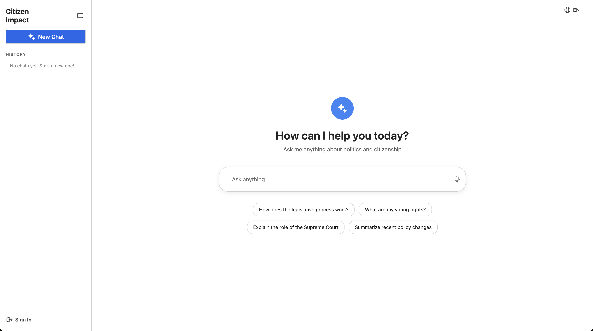
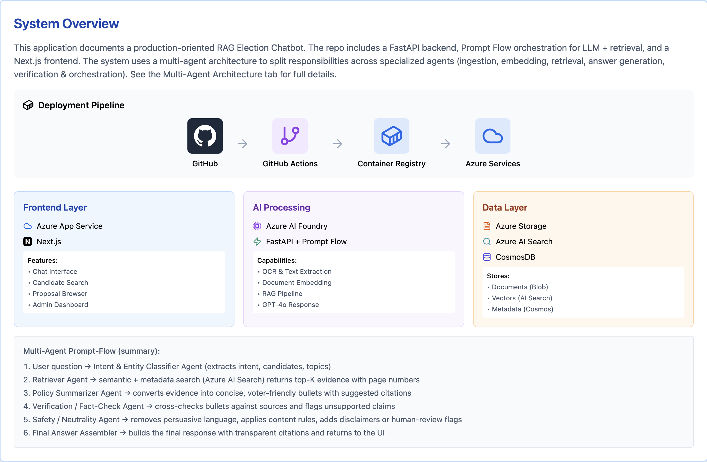
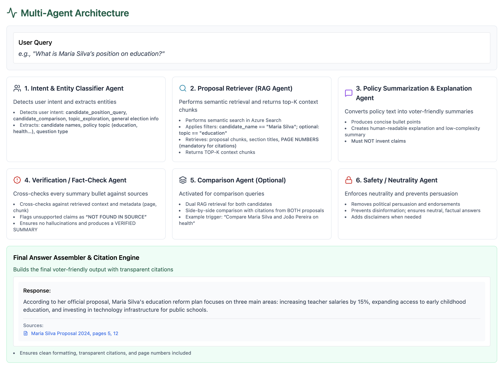

# Citizen Impact

**Citizen Impact** is an intelligent civic engagement platform designed to combat misinformation and simplify election complexity. Built for the Microsoft Innovation Hackathon, it uses a **Multi-Agent RAG (Retrieval-Augmented Generation)** architecture to provide voters with neutral, fact-checked, and cited answers about candidate proposals.



## What This Project Does

Citizen Impact allows users to ask questions about political candidates and their policy proposals in natural language. Unlike standard LLMs that may hallucinate, our system:

1.  **Ingests official documents:** PDFs of government plans and candidate manifestos.
2.  **Retrieves precise context:** Uses Azure AI Search to find exact page numbers and paragraphs.
3.  **Verifies facts:** A dedicated AI agent cross-checks generated answers against the source text to prevent hallucinations.
4.  **Enforces neutrality:** A safety agent filters out persuasive language to ensure unbiased information.

## Key Features

- **Multi-Agent Orchestration:** Decomposes complex queries (e.g., "Compare Candidate A and B on Health") into sub-tasks using Azure Prompt Flow.
- **Transparent Citations:** Every answer includes direct references to the source document and page number.
- **Safety & Neutrality Guardrails:** specialized agents ensure the bot remains non-partisan and factually accurate.
- **Persistent History:** Users can sign up to save their conversation history (stored in Azure Cosmos DB).
- **Modern Stack:** Built with Next.js 16 (React 19) and Fluent UI for a seamless Microsoft-native feel.

## Architecture

The solution is split into three core microservices deployed via Azure Container Registry (ACR) to Azure App Services:

| Service      | Path            | Tech Stack                   | Description                                       |
| :----------- | :-------------- | :--------------------------- | :------------------------------------------------ |
| **Frontend** | `/frontend`     | Next.js, Fluent UI, Tailwind | Responsive chat interface with authentication.    |
| **Backend**  | `/backend`      | Python, FastAPI, CosmosDB    | API Gateway, auth provider, and chat persistence. |
| **AI Core**  | `/multi-agents` | Prompt Flow, Azure OpenAI    | The cognitive engine running the multi-agent DAG. |

<!-- Diagrams -->





## Getting Started

### Prerequisites

- [Docker Desktop](https://www.docker.com/products/docker-desktop/)
- [Node.js 18+](https://nodejs.org/)
- [Python 3.11+](https://www.python.org/)
- **Azure Resources**: OpenAI (GPT-4o, Embeddings), AI Search, Cosmos DB.

### 1\. Infrastructure Setup

The infrastructure is defined as code (IaC) using Bicep.

```bash
cd infrastructure
# Deploy core resources
az deployment group create --resource-group civic-chatbot-rg --template-file main.bicep
# See infrastructure/README.md for AI Studio setup details
```

### 2\. Backend Setup (FastAPI)

Create a `.env` file in `backend/` based on your Azure keys.

```bash
cd backend
pip install -r requirements.txt

# Run locally on port 8000
uvicorn main:app --reload --port 8000
```

### 3\. AI Agent Setup (Prompt Flow)

The Prompt Flow engine runs as a separate service (or local endpoint).

```bash
cd multi-agents
pip install -r requirements.txt

# Start the flow serving on port 8080
python boot.py
```

### 4\. Frontend Setup (Next.js)

Create a `.env.local` in `frontend/` (see `.env.example`).

```bash
cd frontend
npm install

# Run locally on port 3000
npm run dev
```

Visit `http://localhost:3000` to interact with the bot.

## The "Smart" Part: Multi-Agent Flow

We don't just call an LLM. We orchestrate a Directed Acyclic Graph (DAG) of agents:

1.  **Intent Classifier:** Decides if the user wants to _compare_ candidates, _query_ a specific position, or is _off-topic_.
2.  **Real RAG Retriever:** Fetches vector embeddings + keyword matches from Azure AI Search.
3.  **Policy Summarizer:** Condenses legislative text into voter-friendly bullet points.
4.  **Fact Checker:** **(Crucial Step)** Verifies that the summary actually exists in the retrieved chunks.
5.  **Safety/Neutrality:** Rewrites content to remove emotional loading or bias.

_See `multi-agents/flow.dag.yaml` for the workflow logic._

## Documentation

- [Backend Deployment Guide](https://github.com/anrkuist/microsoft-hackathon/backend/README.md)
- [Frontend Deployment Guide](https://anrkuist/microsoft-hackathon/infrastructure/README.md)
- [AI Foundry & Model Setup](https://anrkuist/microsoft-hackathon/foundry/README.md)

- **Event:** Microsoft Innovation Hackathon
